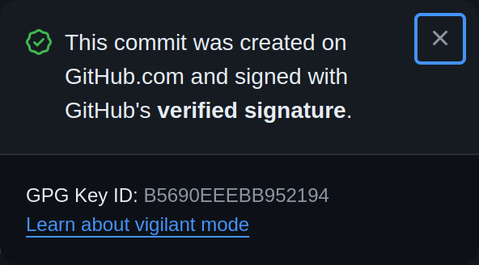

# `@changesets/ghcommit`

> [!IMPORTANT]
> This is the development branch for `@changesets/ghcommit` v3. For the v2 code, check out the [maintenance/v2](https://github.com/changesets/ghcommit/tree/maintenance/v2) branch.

[](https://npmx.dev/package/@changesets/ghcommit)
[](./CHANGELOG.md)

Commit file changes to GitHub repositories with the GitHub API.

## Why?

- **Simplified GPG Signing:**

  If you or your organization has strict requirements around requiring signed commits (i.e. via Branch Protection or Repo Rulesets), then this can make integrating CI workflows or applications that are designed to make changes to your repos quite difficult. This is because you will need to manage your own GPG keys, assign them to machine accounts (which also means it doesn't work with GitHub Apps), and securely manage and rotate them.

  Instead of doing this, if you use the GitHub API to make changes to files (such as what happens when making changes to files directly in the web UI), then GitHub's internal GPG key is used, and commits are all signed and associated with the user of the access token that was used.

  (And this also works with GitHub Apps too).

  

  This library has primarily been designed for use in GitHub Actions, but can be used in any Node.js or JavaScript project that needs to directly modify files in GitHub repositories.

- **Simplified Git Config:**

  When performing git actions via the GitHub API, all actions are always attributed to the actor whose `GITHUB_TOKEN` is being used (whether an app, or user), and this information is reflected in the git committer and author. As such, it's no longer necessary (or even possible) to specify the commit author (name and email address).

  This simplifies the process of preparing your workflows for pushing changes, as you no longer need to configure the name and email address in git, and ensure they appropriately match any GPG keys used.

## Usage

### Installation

Install using your favorite package manager:

```bash
pnpm install @changesets/ghcommit
```

### Octokit

The library requires an [Octokit](https://github.com/octokit/octokit.js) client to call the GitHub APIs. It requires the `@octokit/core`, `@octokit/plugin-rest-endpoint-methods`, and `@octokit/plugin-paginate-rest` packages to be set up in order to work.

If you're running this in GitHub Actions, this can be done using the `@actions/github` library:

```ts
import { getOctokit } from "@actions/github";

const octokit = getOctokit(process.env.GITHUB_TOKEN);
```

## API

Check the respective JSDoc for the complete documentation.

### `commitChanges`

> Works in Node.js and browsers

Commit file changes to a branch using the GitHub API.

Example:

```ts
import fs from "node:fs/promises";
import { context, getOctokit } from "@actions/github";
import { commitChanges } from "@changesets/ghcommit";

const octokit = getOctokit(process.env.GITHUB_TOKEN);
const owner = context.repo.owner;
const repo = context.repo.repo;

// Commit the changes to README.md and delete the lockfile based on the main branch
await commitChanges({
  octokit,
  owner,
  repo,
  branch: "new-branch-to-create",
  message: "[chore] do something",
  base: {
    branch: "main",
  },
  fileChanges: {
    additions: [
      { path: "README.md", content: await fs.readFile("README.md", "base64") },
    ],
    deletions: [{ path: "package-lock.json" }],
  },
});
```

### `commitChangesSinceBase`

> Works in Node.js only

Commit file changes since a local git base (defaults to HEAD). This executes the `git` command to determine the changes and then uses `commitChanges` to commit them to the given branch.

The default HEAD base includes all uncommitted changes since the last commit. If previous commits have been made locally and not pushed, you need to set `base` to the last commit that is known to be in the remote repository.

Example:

```ts
import { context, getOctokit } from "@actions/github";
import { commitChangesSinceBase } from "@changesets/ghcommit";

const octokit = getOctokit(process.env.GITHUB_TOKEN);
const owner = context.repo.owner;
const repo = context.repo.repo;

// Commit the file changes from the current directory
await commitChangesSinceBase({
  octokit,
  owner,
  repo,
  branch: "new-branch-to-create",
  message: "[chore] do something",
  cwd: process.cwd(),
});

// Commit the file changes from a different directory (and git repo)
await commitChangesSinceBase({
  octokit,
  owner: "my-org",
  repo: "my-repo",
  branch: "new-branch-to-create",
  message: "[chore] do something else",
  cwd: "/tmp/some-repo",
});

// Commit the file changes including commits added since the workflow run
await commitChangesSinceBase({
  octokit,
  owner,
  repo,
  branch: "new-branch-to-create",
  message: "[chore] do something else",
  cwd: process.cwd(),
  base: {
    commit: context.sha, // The initial SHA of the workflow run
  },
});
```

## Known Limitations

The GitHub API does not allow committing executable files, symbolic links, or submodule changes. If you need to commit any of these types of files, you will need to use the Git CLI instead.

## Other Tools / Alternatives

- [planetscale/ghcommit](https://github.com/planetscale/ghcommit) - Go library for committing to GitHub using graphql
- [planetscale/ghcommit-action](https://github.com/planetscale/ghcommit-action) - GitHub Action to detect file changes and commit using the above library
